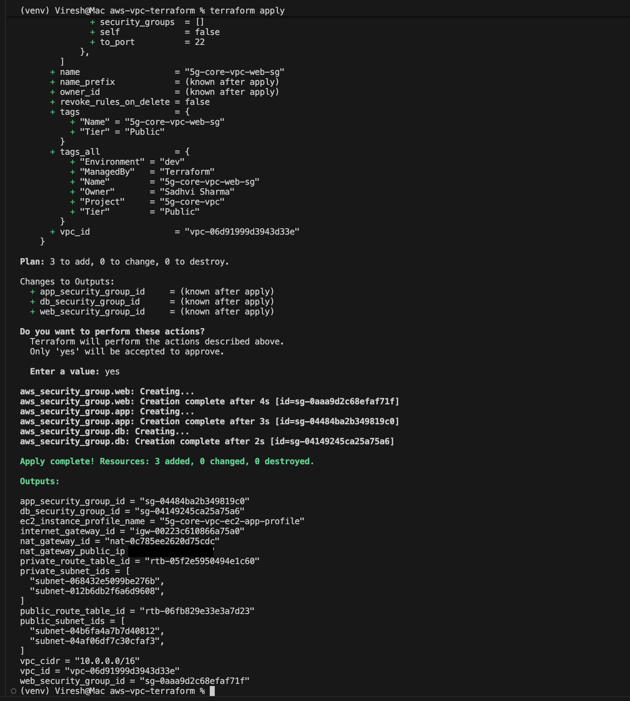
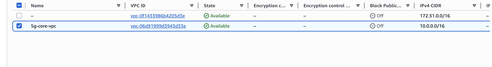
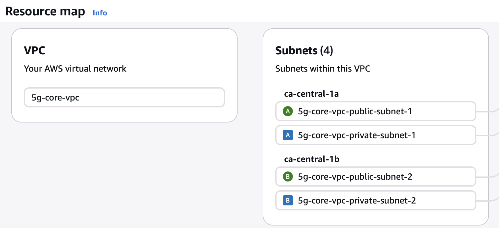
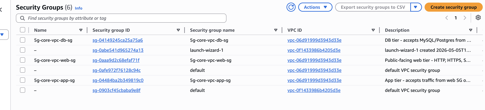
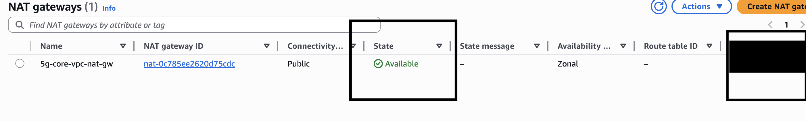

# AWS VPC Network Architecture — Terraform IaC

> Production-grade AWS cloud network infrastructure provisioned entirely with Terraform.  
> Architecture modelled on Nokia 5G Packet Core network segmentation principles.

[](https://www.terraform.io)
[](https://aws.amazon.com)
[]()
[]()

---

## What This Project Does

Provisions a complete, secure, multi-tier AWS network infrastructure from scratch using
Terraform Infrastructure as Code — including VPC, public and private subnets across 2
Availability Zones, NAT Gateway, Internet Gateway, route tables, three-tier Security Groups,
Network ACLs, and IAM least-privilege roles.

Every resource is defined in code, version-controlled, and fully reproducible.
One command builds the entire infrastructure. One command destroys it cleanly.

---

## Architecture

```
                          INTERNET
                              │
                   ┌──────────▼──────────┐
                   │   Internet Gateway   │
                   └──────────┬──────────┘
                              │
        ┌─────────────────────▼────────────────────┐
        │              VPC  10.0.0.0/16             │
        │                                           │
        │   ┌───────────────────────────────────┐   │
        │   │         PUBLIC SUBNETS            │   │
        │   │   AZ1: 10.0.1.0/24               │   │
        │   │   AZ2: 10.0.2.0/24               │   │
        │   │                                   │   │
        │   │   [ Bastion ]   [ NAT Gateway ]   │   │
        │   │   Web SG        Elastic IP         │   │
        │   └──────────────────┬────────────────┘   │
        │                      │ outbound only       │
        │   ┌──────────────────▼────────────────┐   │
        │   │         PRIVATE SUBNETS           │   │
        │   │   AZ1: 10.0.10.0/24              │   │
        │   │   AZ2: 10.0.11.0/24              │   │
        │   │                                   │   │
        │   │   [ App EC2 ]     [ RDS / DB ]    │   │
        │   │   App SG          DB SG            │   │
        │   │   IAM Role        IAM Role         │   │
        │   └───────────────────────────────────┘   │
        └───────────────────────────────────────────┘
```

---

## Nokia 5G Packet Core → AWS Architecture Mapping

This project was designed by applying **Nokia 5G Packet Core network segmentation principles**
to AWS cloud infrastructure — the same distributed systems thinking used to manage
millions of concurrent mobile subscribers, translated into cloud networking constructs.

| Nokia 5G Function | AWS Equivalent | Purpose |
|---|---|---|
| N6 Interface (external) | Internet Gateway + Public Subnet | External traffic entry point |
| AMF (Access & Mobility) | NAT Gateway | Manages outbound sessions, shields core |
| SMF (Session Management) | Route Tables | Defines all traffic paths |
| UPF (User Plane Function) | Private Subnets | Processes internal traffic, no direct exposure |
| NF Access Control | Security Groups | Per-tier stateful traffic filtering |
| Transport Security Policy | Network ACLs | Stateless subnet-boundary enforcement |
| NF Authentication | IAM Roles + Instance Profiles | Least-privilege identity per workload |
| CDR (Charging Data Records) | VPC Flow Logs | Full network audit trail |

---

## Infrastructure Components

| Resource | Count | Details |
|---|---|---|
| VPC | 1 | `10.0.0.0/16` — DNS enabled |
| Internet Gateway | 1 | Public internet access |
| Public Subnets | 2 | One per AZ — `ca-central-1a`, `ca-central-1b` |
| Private Subnets | 2 | One per AZ — no direct internet access |
| NAT Gateway | 1 | Elastic IP — outbound internet for private tier |
| Route Tables | 2 | Public (via IGW) + Private (via NAT) |
| Security Groups | 3 | Web tier, App tier, DB tier |
| Network ACLs | 2 | Public NACL + Private NACL |
| IAM Role | 1 | EC2 app role — SSM + CloudWatch + S3 scoped |
| IAM Instance Profile | 1 | Attaches role to EC2 instances |
| VPC Flow Logs | Optional | CloudWatch log group — enable in tfvars |
| **Total** | **22** | **All resources managed by Terraform** |

---

## Security Design — Defence in Depth

### Layer 1 — Security Groups (Stateful)

Traffic flows in one direction only — each tier only accepts traffic from the tier directly above it:

```
Internet → Web SG (80/443) → App SG (8080) → DB SG (3306/5432)
```

No tier can be accessed directly from the internet except the Web tier.
The DB tier has zero inbound rules from outside the App SG.

### Layer 2 — Network ACLs (Stateless)

Second line of defence at the subnet boundary:

- Public NACL — allows 80/443 + ephemeral return ports + restricted SSH
- Private NACL — allows VPC-internal traffic + return traffic from internet only

### Layer 3 — IAM Least Privilege

EC2 instances never use hardcoded credentials:
- Instance profiles rotate automatically — no access keys in code
- S3 access scoped to project-specific bucket only
- SSM access enabled — no SSH keys required for instance management
- CloudWatch agent permitted — metrics published securely

---

## Key Design Decisions

**Why two Availability Zones?**
Single AZ failure is a real event on AWS. Two AZs means if `ca-central-1a` goes down,
`ca-central-1b` continues serving traffic. Same principle Nokia uses for redundant
node deployment across geographic sites to eliminate single points of failure.

**Why NAT Gateway in public subnet only?**
Private subnet instances need outbound internet access (OS patches, API calls)
without being publicly accessible. NAT Gateway sits in the public subnet, handles
all outbound requests from private instances, and never exposes them directly —
identical to how Nokia's AMF manages subscriber sessions without exposing core NFs.

**Why Security Groups AND NACLs?**
Security Groups are stateful and easy to manage — your first line.
NACLs are stateless and operate at the subnet level — your second line.
Neither alone is sufficient. Together they mirror Nokia's layered transport
security approach: per-NF access control + transport boundary policy.

**Why no hardcoded credentials?**
IAM instance profiles are the AWS-native way to grant EC2 permissions.
Credentials rotate automatically, never appear in code, and follow
the same zero-trust principle Nokia applies to inter-NF authentication.

---

## Deployment

### Prerequisites
- [Terraform](https://developer.hashicorp.com/terraform/downloads) >= 1.3.0
- AWS CLI configured (`aws configure`)
- AWS account with VPC and IAM permissions

### Deploy

```bash
# Clone
git clone https://github.com/sadvi11/aws-vpc-terraform.git
cd aws-vpc-terraform

# Initialise — downloads AWS provider
terraform init

# Preview — no changes made
terraform plan

# Deploy — builds all 22 resources (~3 minutes)
terraform apply

# View all resource IDs
terraform output

# Clean up — removes all resources, stops billing
terraform destroy
```

### Customise

Edit `terraform.tfvars` before deploying:

```hcl
aws_region       = "ca-central-1"   # change to your region
project_name     = "5g-core-vpc"
environment      = "dev"
allowed_ssh_cidr = "YOUR_IP/32"     # curl ifconfig.me to find your IP
enable_flow_logs = true              # enables CloudWatch network audit
```

---

## Deployment Proof

Infrastructure was deployed and verified on AWS `ca-central-1` (Canada Central).

### Apply Complete — 22 Resources Deployed


### VPC Live in AWS Console


### Public and Private Subnets — Multi-AZ


### Three-Tier Security Groups


### NAT Gateway — Public Subnet


---

## Interview Talking Points

This project was built specifically to demonstrate cloud networking skills for
cloud engineer and DevOps engineer roles in the Canadian market.

**Key concepts demonstrated:**

- **VPC design** — public/private subnet segregation with real business rationale
- **High availability** — multi-AZ deployment prevents single AZ failure impact
- **NAT Gateway** — private subnet internet access without public exposure
- **Security Groups vs NACLs** — when to use stateful vs stateless filtering
- **IAM least privilege** — instance profiles, no hardcoded credentials, scoped policies
- **Terraform IaC** — variables, outputs, validation, count, depends_on, default tags
- **Cost management** — infrastructure destroyed when not in use (FinOps mindset)
- **Architecture thinking** — Nokia 5G network segmentation applied to cloud design

---

## Repository Structure

```
aws-vpc-terraform/
├── main.tf           # VPC, subnets, IGW, NAT Gateway, route tables
├── security.tf       # Security Groups (web/app/db) and Network ACLs
├── iam.tf            # IAM roles, instance profiles, VPC Flow Logs
├── variables.tf      # All input variables with validation
├── outputs.tf        # Exports key resource IDs for downstream use
├── terraform.tfvars  # Environment-specific values
├── screenshots/      # Deployment proof screenshots
└── README.md
```

---

## Author

**Sadhvi Sharma** — Cloud & AI Engineer

Nokia India (5G Packet Core Infrastructure) transitioning to Cloud Engineering.
Building a hands-on cloud portfolio aligned with Canadian tech market requirements.

Calgary, AB, Canada — Permanent Resident — Open to Relocation

[LinkedIn](https://linkedin.com/in/sadhvi-sharma-5789a6249) | [GitHub](https://github.com/sadvi11) | [Portfolio](https://github.com/sadvi11/smart-ai-agent)
